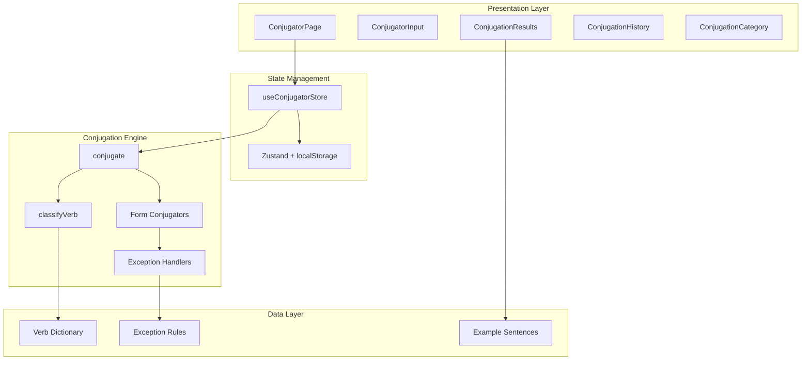

# Design Document: Japanese Verb Conjugator

## Overview

The Japanese Verb Conjugator is a comprehensive tool that transforms Japanese verbs from their dictionary form into all grammatical conjugation forms. The system consists of a pure-function conjugation engine that handles all verb types (Godan, Ichidan, irregular) and their exceptions, paired with a premium React-based UI that provides an intuitive, responsive interface for Japanese learners.

The architecture separates the conjugation logic from the presentation layer, enabling thorough testing via property-based tests and potential reuse across the application. The UI follows KanaDojo's existing design patterns while introducing collapsible category cards for organized conjugation display.

## Architecture



## Components and Interfaces

### Conjugation Engine (`features/Conjugator/lib/engine/`)

```typescript
// Core types
interface VerbInfo {
  dictionaryForm: string; // Original input (kanji)
  reading: string; // Hiragana reading
  romaji: string; // Romanized form
  type: VerbType; // Godan | Ichidan | Irregular
  stem: string; // Verb stem for conjugation
  ending: string; // Final character(s)
  irregularType?: IrregularType; // する | 来る | ある | 行く | Honorific
}

type VerbType = 'godan' | 'ichidan' | 'irregular';
type IrregularType = 'suru' | 'kuru' | 'aru' | 'iku' | 'honorific';

interface ConjugationForm {
  name: string; // Form name (e.g., "te-form")
  nameJapanese: string; // Japanese name (e.g., "て形")
  kanji: string; // Conjugated form with kanji
  hiragana: string; // Hiragana reading
  romaji: string; // Romanized form
  formality: 'plain' | 'polite';
  category: ConjugationCategory;
}

type ConjugationCategory =
  | 'basic'
  | 'polite'
  | 'negative'
  | 'past'
  | 'volitional'
  | 'potential'
  | 'passive'
  | 'causative'
  | 'causative-passive'
  | 'imperative'
  | 'conditional'
  | 'tai-form'
  | 'progressive'
  | 'honorific';

interface ConjugationResult {
  verb: VerbInfo;
  forms: ConjugationForm[];
  timestamp: number;
}

// Main API
function conjugate(input: string): ConjugationResult;
function classifyVerb(input: string): VerbInfo;
function conjugateToForm(verb: VerbInfo, form: string): ConjugationForm;
function serializeResult(result: ConjugationResult): string;
function deserializeResult(json: string): ConjugationResult;
```

### UI Components (`features/Conjugator/components/`)

```typescript
// ConjugatorPage - Main container
interface ConjugatorPageProps {
  locale?: string;
}

// ConjugatorInput - Verb input with validation
interface ConjugatorInputProps {
  value: string;
  onChange: (value: string) => void;
  onConjugate: () => void;
  isLoading: boolean;
  error: string | null;
}

// ConjugationResults - Display all conjugated forms
interface ConjugationResultsProps {
  result: ConjugationResult | null;
  isLoading: boolean;
}

// ConjugationCategory - Collapsible category card
interface ConjugationCategoryProps {
  category: ConjugationCategory;
  forms: ConjugationForm[];
  isExpanded: boolean;
  onToggle: () => void;
  onCopy: (form: ConjugationForm) => void;
}

// ConjugationHistory - Recent verbs sidebar
interface ConjugationHistoryProps {
  entries: HistoryEntry[];
  onSelect: (entry: HistoryEntry) => void;
  onDelete: (id: string) => void;
  onClearAll: () => void;
}

// VerbInfoCard - Display verb type and stem
interface VerbInfoCardProps {
  verb: VerbInfo;
}
```

### Store (`features/Conjugator/store/`)

```typescript
interface ConjugatorState {
  // Input
  inputText: string;

  // Results
  result: ConjugationResult | null;

  // UI State
  isLoading: boolean;
  error: string | null;
  expandedCategories: Set<ConjugationCategory>;

  // History
  history: HistoryEntry[];

  // Actions
  setInputText: (text: string) => void;
  conjugate: () => void;
  toggleCategory: (category: ConjugationCategory) => void;
  expandAllCategories: () => void;
  collapseAllCategories: () => void;
  copyForm: (form: ConjugationForm) => void;
  copyAllForms: () => void;
  loadHistory: () => Promise<void>;
  addToHistory: (result: ConjugationResult) => void;
  deleteFromHistory: (id: string) => void;
  clearHistory: () => void;
  restoreFromHistory: (entry: HistoryEntry) => void;
  initFromUrlParams: (params: { verb?: string }) => boolean;
}

interface HistoryEntry {
  id: string;
  verb: string;
  verbType: VerbType;
  timestamp: number;
}
```

## Data Models

### Verb Classification Data

```typescript
// Irregular verb mappings
const IRREGULAR_VERBS: Record<string, IrregularType> = {
  する: 'suru',
  来る: 'kuru',
  くる: 'kuru',
  ある: 'aru',
  行く: 'iku',
  いく: 'iku',
  // Honorific verbs
  くださる: 'honorific',
  なさる: 'honorific',
  いらっしゃる: 'honorific',
  おっしゃる: 'honorific',
  ござる: 'honorific',
};

// Godan verb ending mappings for conjugation
const GODAN_ENDINGS: Record<string, GodanConjugationMap> = {
  う: { a: 'わ', i: 'い', e: 'え', o: 'お', te: 'って', ta: 'った' },
  く: { a: 'か', i: 'き', e: 'け', o: 'こ', te: 'いて', ta: 'いた' },
  ぐ: { a: 'が', i: 'ぎ', e: 'げ', o: 'ご', te: 'いで', ta: 'いだ' },
  す: { a: 'さ', i: 'し', e: 'せ', o: 'そ', te: 'して', ta: 'した' },
  つ: { a: 'た', i: 'ち', e: 'て', o: 'と', te: 'って', ta: 'った' },
  ぬ: { a: 'な', i: 'に', e: 'ね', o: 'の', te: 'んで', ta: 'んだ' },
  ぶ: { a: 'ば', i: 'び', e: 'べ', o: 'ぼ', te: 'んで', ta: 'んだ' },
  む: { a: 'ま', i: 'み', e: 'め', o: 'も', te: 'んで', ta: 'んだ' },
  る: { a: 'ら', i: 'り', e: 'れ', o: 'ろ', te: 'って', ta: 'った' },
};
```

### Conjugation Form Definitions

```typescript
const CONJUGATION_FORMS: FormDefinition[] = [
  // Basic forms
  {
    id: 'dictionary',
    category: 'basic',
    name: 'Dictionary Form',
    nameJa: '辞書形',
  },
  { id: 'masu', category: 'polite', name: 'Masu Form', nameJa: 'ます形' },
  { id: 'te', category: 'basic', name: 'Te Form', nameJa: 'て形' },
  { id: 'ta', category: 'past', name: 'Ta Form (Past)', nameJa: 'た形' },
  {
    id: 'nai',
    category: 'negative',
    name: 'Nai Form (Negative)',
    nameJa: 'ない形',
  },
  {
    id: 'nakatta',
    category: 'negative',
    name: 'Nakatta Form',
    nameJa: 'なかった形',
  },

  // Polite forms
  {
    id: 'masen',
    category: 'polite',
    name: 'Masen (Polite Negative)',
    nameJa: 'ません',
  },
  {
    id: 'mashita',
    category: 'polite',
    name: 'Mashita (Polite Past)',
    nameJa: 'ました',
  },
  {
    id: 'masen-deshita',
    category: 'polite',
    name: 'Masen Deshita',
    nameJa: 'ませんでした',
  },

  // Volitional
  {
    id: 'volitional-plain',
    category: 'volitional',
    name: 'Volitional (Plain)',
    nameJa: '意向形',
  },
  {
    id: 'volitional-polite',
    category: 'volitional',
    name: 'Volitional (Polite)',
    nameJa: 'ましょう',
  },

  // Potential
  {
    id: 'potential-plain',
    category: 'potential',
    name: 'Potential (Plain)',
    nameJa: '可能形',
  },
  {
    id: 'potential-polite',
    category: 'potential',
    name: 'Potential (Polite)',
    nameJa: '可能形丁寧',
  },
  {
    id: 'potential-negative',
    category: 'potential',
    name: 'Potential (Negative)',
    nameJa: '可能形否定',
  },

  // Passive
  {
    id: 'passive-plain',
    category: 'passive',
    name: 'Passive (Plain)',
    nameJa: '受身形',
  },
  {
    id: 'passive-polite',
    category: 'passive',
    name: 'Passive (Polite)',
    nameJa: '受身形丁寧',
  },

  // Causative
  {
    id: 'causative-plain',
    category: 'causative',
    name: 'Causative (Plain)',
    nameJa: '使役形',
  },
  {
    id: 'causative-polite',
    category: 'causative',
    name: 'Causative (Polite)',
    nameJa: '使役形丁寧',
  },

  // Causative-Passive
  {
    id: 'causative-passive-plain',
    category: 'causative-passive',
    name: 'Causative-Passive',
    nameJa: '使役受身形',
  },
  {
    id: 'causative-passive-polite',
    category: 'causative-passive',
    name: 'Causative-Passive (Polite)',
    nameJa: '使役受身形丁寧',
  },

  // Imperative
  {
    id: 'imperative-plain',
    category: 'imperative',
    name: 'Imperative (Plain)',
    nameJa: '命令形',
  },
  {
    id: 'imperative-polite',
    category: 'imperative',
    name: 'Imperative (Polite)',
    nameJa: 'てください',
  },
  {
    id: 'imperative-negative',
    category: 'imperative',
    name: 'Negative Imperative',
    nameJa: '禁止形',
  },

  // Conditional
  {
    id: 'conditional-ba',
    category: 'conditional',
    name: 'Ba Form',
    nameJa: 'ば形',
  },
  {
    id: 'conditional-tara',
    category: 'conditional',
    name: 'Tara Form',
    nameJa: 'たら形',
  },
  {
    id: 'conditional-nara',
    category: 'conditional',
    name: 'Nara Form',
    nameJa: 'なら形',
  },

  // Tai-form
  {
    id: 'tai',
    category: 'tai-form',
    name: 'Tai Form (Want to)',
    nameJa: 'たい形',
  },
  {
    id: 'takunai',
    category: 'tai-form',
    name: "Takunai (Don't want)",
    nameJa: 'たくない',
  },
  {
    id: 'takatta',
    category: 'tai-form',
    name: 'Takatta (Wanted)',
    nameJa: 'たかった',
  },
  {
    id: 'takunakatta',
    category: 'tai-form',
    name: 'Takunakatta',
    nameJa: 'たくなかった',
  },

  // Progressive
  {
    id: 'progressive-present',
    category: 'progressive',
    name: 'Te-iru (Continuous)',
    nameJa: 'ている',
  },
  {
    id: 'progressive-past',
    category: 'progressive',
    name: 'Te-ita (Past Continuous)',
    nameJa: 'ていた',
  },

  // Honorific
  {
    id: 'honorific-respectful',
    category: 'honorific',
    name: 'Respectful',
    nameJa: 'お〜になる',
  },
  {
    id: 'honorific-humble',
    category: 'honorific',
    name: 'Humble',
    nameJa: 'お〜する',
  },
];
```

## Correctness Properties

_A property is a characteristic or behavior that should hold true across all valid executions of a system-essentially, a formal statement about what the system should do. Properties serve as the bridge between human-readable specifications and machine-verifiable correctness guarantees._

### Property 1: Conjugation Completeness

_For any_ valid Japanese verb in dictionary form, the conjugation engine SHALL return a result containing all defined conjugation categories with at least one form per category.
**Validates: Requirements 1.1, 3.1-3.13**

### Property 2: Input Format Equivalence

_For any_ Japanese verb that can be represented in kanji, hiragana, and romaji, conjugating any of these three representations SHALL produce semantically equivalent conjugation results.
**Validates: Requirements 1.2**

### Property 3: Whitespace Input Rejection

_For any_ string composed entirely of whitespace characters (spaces, tabs, newlines), the conjugation engine SHALL return an error result and not produce conjugation forms.
**Validates: Requirements 1.3**

### Property 4: Output Format Completeness

_For any_ conjugation form in a valid result, the form SHALL contain non-empty kanji, hiragana, and romaji fields.
**Validates: Requirements 1.5**

### Property 5: Godan Conjugation Correctness

_For any_ Godan verb, the conjugated forms SHALL follow the correct vowel-grade transformation rules based on the verb's final character.
**Validates: Requirements 2.1**

### Property 6: Ichidan Conjugation Correctness

_For any_ Ichidan verb, the conjugated forms SHALL be produced by removing the final る and appending the appropriate suffix.
**Validates: Requirements 2.2**

### Property 7: Compound Verb Prefix Preservation

_For any_ compound verb (する-compound or 来る-compound), all conjugated forms SHALL preserve the original prefix while only conjugating the する or 来る portion.
**Validates: Requirements 2.7, 2.8**

### Property 8: Te-form Sound Changes

_For any_ Godan verb, the te-form SHALL apply the correct sound change based on the verb's final character (う/つ/る→って, む/ぶ/ぬ→んで, く→いて, ぐ→いで, す→して).
**Validates: Requirements 4.1-4.6**

### Property 9: Ichidan Potential Dual Forms

_For any_ Ichidan verb, the potential form output SHALL include both the traditional (-られる) and colloquial (-れる) variants.
**Validates: Requirements 4.9**

### Property 10: Copy-All Format Completeness

_For any_ conjugation result, the copy-all formatted output SHALL contain all conjugation forms organized by category.
**Validates: Requirements 6.2**

### Property 11: History Persistence

_For any_ successfully conjugated verb, adding it to history and then retrieving history SHALL include that verb entry.
**Validates: Requirements 8.1**

### Property 12: History Restoration Correctness

_For any_ verb in history, selecting it SHALL produce conjugation results identical to the original conjugation.
**Validates: Requirements 8.3**

### Property 13: Verb Analysis Correctness

_For any_ valid verb, the detected verb type (Godan/Ichidan/Irregular) and extracted stem SHALL be consistent with the verb's actual classification.
**Validates: Requirements 9.1, 9.2**

### Property 14: Conjugation Determinism

_For any_ verb and target form, calling the conjugation function multiple times with the same input SHALL produce identical results.
**Validates: Requirements 11.2**

### Property 15: Pure Function Behavior

_For any_ conjugation operation, the input verb object SHALL remain unmodified after the operation completes.
**Validates: Requirements 11.3**

### Property 16: Serialization Round-Trip

_For any_ valid ConjugationResult, serializing to JSON and deserializing back SHALL produce an equivalent ConjugationResult object.
**Validates: Requirements 11.4, 11.5**

### Property 17: URL Parameter Conjugation

_For any_ valid verb parameter in a URL, visiting that URL SHALL trigger conjugation and display results for that verb.
**Validates: Requirements 12.2**

### Property 18: Dynamic Meta Tag Generation

_For any_ conjugated verb, the generated meta tags SHALL include the verb name in the title and description, and the canonical URL SHALL match the verb parameter URL.
**Validates: Requirements 13.3, 15.1, 15.2, 15.5**

### Property 19: Structured Data Completeness

_For any_ page render (with or without verb parameter), the JSON-LD structured data SHALL include valid WebApplication, FAQPage, HowTo, and BreadcrumbList schemas.
**Validates: Requirements 13.2**

### Property 20: SEO Content Presence

_For any_ page render, the page SHALL contain semantic HTML with proper heading hierarchy (exactly one h1, followed by h2/h3 sections) and educational content sections.
**Validates: Requirements 13.4, 13.5**

## SEO Architecture

### Meta Tags Strategy

```typescript
// Dynamic meta tag generation for verb-specific pages
interface VerbPageMeta {
  title: string; // "食べる (taberu) Conjugation - All Japanese Verb Forms | KanaDojo"
  description: string; // Unique description with verb name and key forms
  keywords: string[]; // Verb-specific + general conjugation keywords
  canonicalUrl: string; // https://kanadojo.com/conjugate?verb=食べる
  ogImage: string; // Dynamic OG image with verb
}

function generateVerbMeta(verb: VerbInfo): VerbPageMeta;

// Base page meta for /conjugate without specific verb
const BASE_META = {
  title: 'Japanese Verb Conjugator - Free Online Tool | KanaDojo',
  description:
    'Free Japanese verb conjugator with all conjugation forms. Conjugate any Japanese verb instantly - Godan, Ichidan, irregular verbs. Get te-form, masu-form, potential, passive, causative and more.',
  keywords: [
    'Japanese verb conjugator',
    'Japanese verb conjugation',
    'conjugate Japanese verbs',
    'Japanese te form',
    'Japanese masu form',
    'Japanese verb forms',
    'learn Japanese verbs',
    'Japanese grammar tool',
    'free Japanese conjugator',
  ],
};
```

### JSON-LD Structured Data

```typescript
// Comprehensive structured data schema
const conjugatorSchema = {
  '@context': 'https://schema.org',
  '@graph': [
    // WebApplication schema
    {
      '@type': 'WebApplication',
      '@id': 'https://kanadojo.com/conjugate#webapp',
      name: 'KanaDojo Japanese Verb Conjugator',
      alternateName: [
        'Japanese Verb Conjugator',
        'Free Japanese Conjugation Tool',
      ],
      url: 'https://kanadojo.com/conjugate',
      applicationCategory: 'EducationalApplication',
      applicationSubCategory: 'Language Learning Tool',
      operatingSystem: 'Any',
      offers: { '@type': 'Offer', price: '0', priceCurrency: 'USD' },
      featureList: [
        'Conjugate all Japanese verb types (Godan, Ichidan, Irregular)',
        'All conjugation forms: te-form, masu-form, potential, passive, causative',
        'Romaji pronunciation for all forms',
        'Verb type detection and explanation',
        'Copy conjugations to clipboard',
        'Conjugation history',
        'Mobile-responsive design',
      ],
      aggregateRating: {
        '@type': 'AggregateRating',
        ratingValue: '4.9',
        ratingCount: '1847',
      },
    },

    // FAQPage schema
    {
      '@type': 'FAQPage',
      '@id': 'https://kanadojo.com/conjugate#faq',
      mainEntity: [
        {
          '@type': 'Question',
          name: 'What is a Japanese verb conjugator?',
          acceptedAnswer: {
            '@type': 'Answer',
            text: 'A Japanese verb conjugator is a tool that transforms Japanese verbs from their dictionary form into various grammatical forms such as past tense, negative, potential, passive, and more. Our free conjugator handles all verb types including Godan (u-verbs), Ichidan (ru-verbs), and irregular verbs.',
          },
        },
        {
          '@type': 'Question',
          name: 'How do I conjugate Japanese verbs?',
          acceptedAnswer: {
            '@type': 'Answer',
            text: 'Enter any Japanese verb in its dictionary form (the form ending in -u) into our conjugator. The tool will automatically detect the verb type and generate all conjugation forms including te-form, masu-form, potential, passive, causative, conditional, and more.',
          },
        },
        // ... additional FAQ items
      ],
    },

    // HowTo schema
    {
      '@type': 'HowTo',
      '@id': 'https://kanadojo.com/conjugate#howto',
      name: 'How to Conjugate Japanese Verbs',
      description:
        'Step-by-step guide to conjugating Japanese verbs using KanaDojo',
      step: [
        {
          '@type': 'HowToStep',
          position: 1,
          name: 'Enter verb',
          text: 'Type a Japanese verb in dictionary form',
        },
        {
          '@type': 'HowToStep',
          position: 2,
          name: 'Click conjugate',
          text: 'Press the conjugate button or hit Enter',
        },
        {
          '@type': 'HowToStep',
          position: 3,
          name: 'View all forms',
          text: 'See all conjugation forms organized by category',
        },
        {
          '@type': 'HowToStep',
          position: 4,
          name: 'Copy forms',
          text: 'Click to copy individual forms or all conjugations',
        },
      ],
    },

    // BreadcrumbList
    {
      '@type': 'BreadcrumbList',
      itemListElement: [
        {
          '@type': 'ListItem',
          position: 1,
          item: { '@id': 'https://kanadojo.com', name: 'Home' },
        },
        {
          '@type': 'ListItem',
          position: 2,
          item: { '@id': 'https://kanadojo.com/tools', name: 'Tools' },
        },
        {
          '@type': 'ListItem',
          position: 3,
          item: {
            '@id': 'https://kanadojo.com/conjugate',
            name: 'Verb Conjugator',
          },
        },
      ],
    },
  ],
};

// Dynamic schema for specific verb pages
function generateVerbSchema(verb: VerbInfo, result: ConjugationResult) {
  return {
    '@type': 'DefinedTerm',
    '@id': `https://kanadojo.com/conjugate?verb=${encodeURIComponent(verb.dictionaryForm)}`,
    name: `${verb.dictionaryForm} conjugation`,
    description: `Complete conjugation of the Japanese verb ${verb.dictionaryForm} (${verb.romaji})`,
    inDefinedTermSet: {
      '@type': 'DefinedTermSet',
      name: 'Japanese Verb Conjugations',
    },
  };
}
```

### SEO Content Components

```typescript
// SEOContent component structure
interface SEOContentProps {
  locale: string;
  verb?: VerbInfo; // For verb-specific content
}

// Sections to include:
// 1. Educational introduction to Japanese verb conjugation
// 2. Explanation of verb types (Godan, Ichidan, Irregular)
// 3. Common conjugation forms explained
// 4. Tips for learning Japanese verb conjugation
// 5. Internal links to related features
// 6. Comprehensive FAQ section

// AI/LLM-friendly content block
interface LLMContentBlock {
  topic: string;
  content: string;
  citations: string[];
  lastUpdated: string;
}
```

### Sitemap Integration

```typescript
// Popular verbs to include in sitemap for indexing
const POPULAR_VERBS_FOR_SITEMAP = [
  // Most common verbs
  'する',
  '行く',
  '来る',
  '見る',
  '食べる',
  '飲む',
  '書く',
  '読む',
  '話す',
  '聞く',
  '買う',
  '売る',
  '作る',
  '使う',
  '思う',
  '知る',
  '分かる',
  '出る',
  '入る',
  '帰る',
  '待つ',
  '持つ',
  '取る',
  '置く',
  // JLPT N5 essential verbs
  'ある',
  'いる',
  'なる',
  '言う',
  '会う',
  '開ける',
  '閉める',
  // Common irregular and special verbs
  '勉強する',
  '運動する',
  '料理する',
  '掃除する',
];

// Sitemap entry generator
function generateConjugatorSitemapEntries(): SitemapEntry[] {
  return [
    { url: '/conjugate', priority: 0.9, changefreq: 'weekly' },
    ...POPULAR_VERBS_FOR_SITEMAP.map(verb => ({
      url: `/conjugate?verb=${encodeURIComponent(verb)}`,
      priority: 0.7,
      changefreq: 'monthly',
    })),
  ];
}
```

### Internal Linking Strategy

```typescript
// Related features to link from conjugator
const INTERNAL_LINKS = [
  {
    href: '/kana',
    text: 'Practice Hiragana & Katakana',
    description: 'Master Japanese writing systems',
  },
  {
    href: '/kanji',
    text: 'Learn Kanji by JLPT Level',
    description: 'Study kanji for JLPT N5-N1',
  },
  {
    href: '/vocabulary',
    text: 'Vocabulary Training',
    description: 'Build your Japanese vocabulary',
  },
  {
    href: '/translate',
    text: 'Japanese Translator',
    description: 'Translate English to Japanese',
  },
  {
    href: '/academy',
    text: 'Japanese Academy',
    description: 'Structured Japanese lessons',
  },
];
```

## Error Handling

### Input Validation Errors

| Error Code           | Condition                         | User Message                                                                        |
| -------------------- | --------------------------------- | ----------------------------------------------------------------------------------- |
| `EMPTY_INPUT`        | Empty or whitespace-only input    | "Please enter a Japanese verb"                                                      |
| `INVALID_CHARACTERS` | Non-Japanese characters detected  | "Please enter a valid Japanese verb using hiragana, katakana, or kanji"             |
| `UNKNOWN_VERB`       | Verb not recognized in dictionary | "This verb is not recognized. Please check the spelling or try the dictionary form" |
| `AMBIGUOUS_VERB`     | Multiple possible interpretations | "This input could be multiple verbs. Please select the intended verb"               |

### Runtime Errors

| Error Code            | Condition                    | Handling                                     |
| --------------------- | ---------------------------- | -------------------------------------------- |
| `CONJUGATION_FAILED`  | Unexpected conjugation error | Log error, show generic message, offer retry |
| `HISTORY_LOAD_FAILED` | localStorage access failed   | Continue without history, show warning       |
| `CLIPBOARD_FAILED`    | Clipboard API unavailable    | Show fallback with selectable text           |

## Testing Strategy

### Property-Based Testing

The conjugation engine will be tested using **fast-check** as the property-based testing library. Each correctness property will be implemented as a property-based test with a minimum of 100 iterations.

```typescript
// Example property test structure
import fc from 'fast-check';

describe('Conjugation Engine Properties', () => {
  // Property 1: Conjugation Completeness
  it('should produce all conjugation categories for any valid verb', () => {
    fc.assert(
      fc.property(validVerbArbitrary, verb => {
        const result = conjugate(verb);
        const categories = new Set(result.forms.map(f => f.category));
        return REQUIRED_CATEGORIES.every(cat => categories.has(cat));
      }),
      { numRuns: 100 },
    );
  });
});
```

### Test Data Generators

```typescript
// Arbitrary for valid Godan verbs
const godanVerbArbitrary = fc.oneof(
  fc.constantFrom(
    '書く',
    '読む',
    '話す',
    '待つ',
    '買う',
    '泳ぐ',
    '死ぬ',
    '遊ぶ',
    '帰る',
  ),
  // Generate synthetic Godan verbs
  fc
    .tuple(
      fc.string(),
      fc.constantFrom('く', 'ぐ', 'す', 'つ', 'ぬ', 'ぶ', 'む', 'る', 'う'),
    )
    .map(([stem, ending]) => stem + ending),
);

// Arbitrary for valid Ichidan verbs
const ichidanVerbArbitrary = fc.oneof(
  fc.constantFrom('食べる', '見る', '起きる', '寝る', '着る', '出る'),
  // Generate synthetic Ichidan verbs
  fc.string().map(stem => stem + 'る'),
);

// Arbitrary for all valid verbs
const validVerbArbitrary = fc.oneof(
  godanVerbArbitrary,
  ichidanVerbArbitrary,
  fc.constantFrom('する', '来る', 'ある', '行く'), // Irregulars
);
```

### Unit Tests

Unit tests will cover:

- Specific irregular verb conjugations (する, 来る, ある, 行く, honorific verbs)
- Edge cases for te-form sound changes
- Compound verb handling
- Input validation edge cases
- UI component rendering and interactions

### Integration Tests

- Full conjugation flow from input to display
- History persistence and restoration
- URL parameter handling
- Copy functionality
